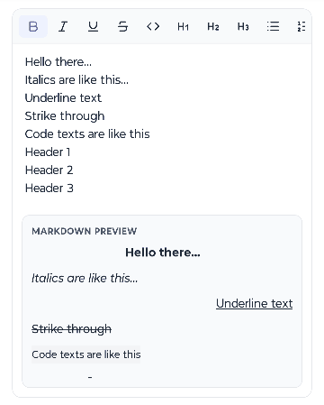

# react-native-richify

A React Native rich text input with a normal `TextInput` editing surface, a horizontally scrollable toolbar, and live Markdown or HTML output below the editor.

[](https://www.npmjs.com/package/react-native-richify)
[](https://github.com/soumya-99/react-native-richify/blob/main/LICENSE)



## Features

- Native editing with no WebView
- Built-in toolbar uses Lucide React Native icons by default
- Inline formatting: bold, italic, underline, strikethrough, code
- Line formatting: H1, H2, H3, bullet list, ordered list, left, center, right
- Link formatting on selected text
- Image insertion through the built-in toolbar
- Output panel can show Markdown or HTML
- Output panel can show raw serialized text or rendered preview
- Auto-growing editor with configurable input and preview height limits
- Custom toolbar items accept text, emoji, or React elements
- Headless `useRichText` hook for fully custom editors
- Typed JSON import and export of editor content

## Installation

Install the package and `react-native-svg`:

```bash
npm install react-native-richify react-native-svg
```

or:

```bash
yarn add react-native-richify react-native-svg
```

`react-native-svg` is required because the built-in toolbar uses Lucide icons. If you want to use Lucide icons in your own custom toolbar items, install that in your app too:

```bash
npm install lucide-react-native
```

The package works in Expo and bare React Native apps. In Expo, `react-native-svg` is usually already available.

## Quick Start

```tsx
import React from 'react';
import { View } from 'react-native';
import { RichTextInput } from 'react-native-richify';

export default function App() {
  return (
    <View style={{ flex: 1, padding: 16 }}>
      <RichTextInput
        placeholder="Write something..."
        showToolbar
        showOutputPreview
        defaultOutputFormat="markdown"
        defaultOutputPreviewMode="rendered"
        onChangeText={(text) => console.log('Plain text:', text)}
        onChangeOutput={(output, format) => {
          console.log(format, output);
        }}
      />
    </View>
  );
}
```

This gives you:

- a visible auto-growing `TextInput`
- the default Lucide-based toolbar
- live Markdown output by default
- a preview panel that opens below the input when content exists

## How The Editor Works

The editing surface is always a normal `TextInput`. The library does not render styled text on top of the input.

Internally, content is stored as `StyledSegment[]`. Each segment contains plain text and formatting metadata. That lets the library:

- keep typing behavior predictable
- apply formatting to selected ranges or future input
- serialize the same content to Markdown or HTML
- export and re-import structured JSON safely

Formatting rules:

- If nothing is selected, pressing a format button affects the next characters you type.
- If text is selected, pressing a format button applies or removes that format immediately.
- Heading, list, and alignment controls work at line level.
- Every formatting button is toggleable except `MD`, `HTML`, `Raw`, and `View`.

## Built-in Toolbar

The default toolbar is horizontally scrollable and ships with these controls:

| Control | Behavior |
| --- | --- |
| Bold, Italic, Underline, Strikethrough, Code | Toggle inline formatting |
| Heading 1, Heading 2, Heading 3 | Toggle heading level on the current line |
| Bullet List, Ordered List | Toggle list type on the current line |
| Link | Apply or clear a hyperlink on the selection |
| Image | Insert an image through your app's image-picking flow |
| Align Left, Align Center, Align Right | Toggle paragraph alignment |
| MD, HTML | Switch serialization format |
| Raw, View | Switch between literal output and rendered preview |

Notes:

- Pressing an active heading button again clears that heading.
- Pressing an active list or alignment button again clears it.
- Link clears when the current selection already has a link.
- Image is a callback-driven action. Your app decides how the URI is chosen.

## Output Panel

The preview panel below the editor is optional and controlled by `showOutputPreview`.

It supports two output formats:

- `markdown`
- `html`

It also supports two display modes:

- `literal`: show the raw Markdown or HTML text
- `rendered`: render the rich output visually

Useful props:

| Prop | Purpose |
| --- | --- |
| `outputFormat` | Controlled Markdown or HTML mode |
| `defaultOutputFormat` | Initial format for uncontrolled usage |
| `outputPreviewMode` | Controlled raw or rendered mode |
| `defaultOutputPreviewMode` | Initial preview mode |
| `maxOutputHeight` | Max preview height before the panel scrolls |
| `onChangeOutput` | Receives the serialized output on every change |
| `onChangeOutputFormat` | Called when toolbar format changes |
| `onChangeOutputPreviewMode` | Called when toolbar preview mode changes |

## Links

Link formatting is selection-based. Select text, then press the link button.

You have two common approaches:

1. Provide `onRequestLink` and open your own prompt, modal, or bottom sheet.
2. Use the built-in fallback, which auto-links only when the selected text already looks like a URL, domain, or email address.

```tsx
<RichTextInput
  onRequestLink={({ selectedText, currentUrl, applyLink }) => {
    console.log(selectedText, currentUrl);
    applyLink('https://example.com');
  }}
/>
```

If the current selection already contains a link, pressing the button clears it.

## Images

The built-in toolbar includes an image button. It does not open the device picker itself. Instead, it calls `onRequestImage`, and your app decides how to produce the final image URI.

```tsx
<RichTextInput
  onRequestImage={async ({ insertImage }) => {
    const result = await pickImageFromYourApp();
    if (!result?.uri) {
      return;
    }

    insertImage(result.uri, {
      alt: result.fileName ?? 'Selected image',
      placeholder: '[image]',
    });
  }}
/>
```

Behavior notes:

- The editor inserts a plain text placeholder into the input so typing remains stable.
- The segment also stores `imageSrc` and optional `imageAlt` metadata.
- `Raw` mode shows Markdown or HTML image output.
- `View` mode renders the image in the output panel.
- If you do not provide `onRequestImage`, the fallback only works when the selected text already looks like an image URL such as `https://site.com/photo.png`.

## Sizing And Input Behavior

`RichTextInput` grows with the text by default.

- `minHeight` sets the minimum input height.
- `maxHeight` limits the input height before the `TextInput` itself scrolls.
- `maxOutputHeight` limits the preview panel height before it scrolls.
- `textInputProps` passes additional native `TextInput` props through to the editor.

```tsx
<RichTextInput
  minHeight={140}
  maxHeight={280}
  maxOutputHeight={220}
  textInputProps={{
    autoCapitalize: 'sentences',
    keyboardType: 'default',
  }}
/>
```

## Customizing The Toolbar

Use `toolbarItems` when you want to keep the built-in toolbar behavior but replace some or all buttons.

`ToolbarItem.label` accepts any React node, so you can use:

- plain text such as `'B'`
- emoji content
- a Lucide icon such as `<Bold />`
- any custom React element

When the label is not plain text, set `accessibilityLabel` so screen readers and tests can identify the button correctly.

Example:

```tsx
import React from 'react';
import { Bold, ImagePlus, List } from 'lucide-react-native';
import { RichTextInput } from 'react-native-richify';

<RichTextInput
  toolbarItems={[
    {
      id: 'bold',
      label: <Bold />,
      accessibilityLabel: 'Bold',
      format: 'bold',
    },
    {
      id: 'note',
      label: 'Note',
      onPress: () => console.log('Custom action'),
    },
    {
      id: 'bullet',
      label: <List />,
      accessibilityLabel: 'Bullet list',
      listType: 'bullet',
    },
    {
      id: 'image',
      label: <ImagePlus />,
      accessibilityLabel: 'Insert image',
      actionType: 'image',
    },
    { id: 'html', label: 'HTML', outputFormat: 'html' },
  ]}
/>
```

Supported built-in item fields:

- `format`
- `heading`
- `listType`
- `textAlign`
- `outputFormat`
- `outputPreviewMode`
- `actionType: 'link' | 'image'`
- `onPress`
- `renderButton`

If you need a completely custom layout, use `renderToolbar`:

```tsx
<RichTextInput
  renderToolbar={({
    actions,
    outputFormat,
    outputPreviewMode,
    onOutputFormatChange,
    onOutputPreviewModeChange,
    onRequestImage,
  }) => (
    <>
      <MyButton onPress={() => actions.toggleFormat('bold')} label="Bold" />
      <MyButton onPress={() => actions.setHeading('h2')} label="Heading" />
      <MyButton onPress={onRequestImage} label="Image" />
      <MyButton
        onPress={() => onOutputFormatChange('html')}
        label={outputFormat === 'html' ? 'HTML on' : 'HTML'}
      />
      <MyButton
        onPress={() => onOutputPreviewModeChange('rendered')}
        label={outputPreviewMode === 'rendered' ? 'Preview on' : 'Preview'}
      />
    </>
  )}
/>
```

## Theming

Use the `theme` prop to override container, toolbar, input, and output styles.

```tsx
<RichTextInput
  theme={{
    colors: {
      primary: '#0F766E',
      background: '#FFFFFF',
      text: '#0F172A',
      placeholder: '#94A3B8',
      toolbarBackground: '#F8FAFC',
      toolbarBorder: '#CBD5E1',
      link: '#0EA5E9',
      cursor: '#0F766E',
    },
    containerStyle: {
      borderRadius: 16,
      borderWidth: 1,
      borderColor: '#CBD5E1',
    },
    outputContainerStyle: {
      margin: 12,
      padding: 12,
      borderRadius: 12,
      backgroundColor: '#F8FAFC',
    },
  }}
/>
```

Common theme keys:

- `containerStyle`
- `inputStyle`
- `baseTextStyle`
- `toolbarStyle`
- `toolbarButtonStyle`
- `toolbarButtonActiveStyle`
- `toolbarButtonTextStyle`
- `toolbarButtonActiveTextStyle`
- `outputContainerStyle`
- `outputLabelStyle`
- `outputTextStyle`
- `renderedOutputStyle`
- `codeStyle`

## Headless Usage

Use `useRichText` when you want to build your own editor shell instead of using `<RichTextInput />`.

```tsx
import React from 'react';
import { Button, TextInput, View } from 'react-native';
import { useRichText } from 'react-native-richify';

export function HeadlessEditor() {
  const { actions } = useRichText({
    onChangeText: (text) => console.log(text),
  });

  return (
    <View>
      <Button title="Bold" onPress={() => actions.toggleFormat('bold')} />
      <Button title="Bullet" onPress={() => actions.setListType('bullet')} />
      <TextInput
        multiline
        value={actions.getPlainText()}
        onChangeText={actions.handleTextChange}
        onSelectionChange={(event) =>
          actions.handleSelectionChange(event.nativeEvent.selection)
        }
        style={{ minHeight: 120, borderWidth: 1, padding: 12 }}
      />
    </View>
  );
}
```

## Data Model And Serialization

The editor stores content as typed segments:

```ts
type StyledSegment = {
  text: string;
  styles: {
    bold?: boolean;
    italic?: boolean;
    underline?: boolean;
    strikethrough?: boolean;
    code?: boolean;
    color?: string;
    backgroundColor?: string;
    fontSize?: number;
    heading?: 'h1' | 'h2' | 'h3' | 'none';
    listType?: 'bullet' | 'ordered' | 'none';
    textAlign?: 'left' | 'center' | 'right';
    link?: string;
    imageSrc?: string;
    imageAlt?: string;
  };
};
```

That makes it straightforward to:

- save content with `exportJSON()`
- restore content with `importJSON()`
- read plain text with `getPlainText()`
- generate Markdown with `getOutput('markdown')`
- generate HTML with `getOutput('html')`

## Contributing

See [AGENTS.md](AGENTS.md) for contributor workflow notes.

## License

MIT
